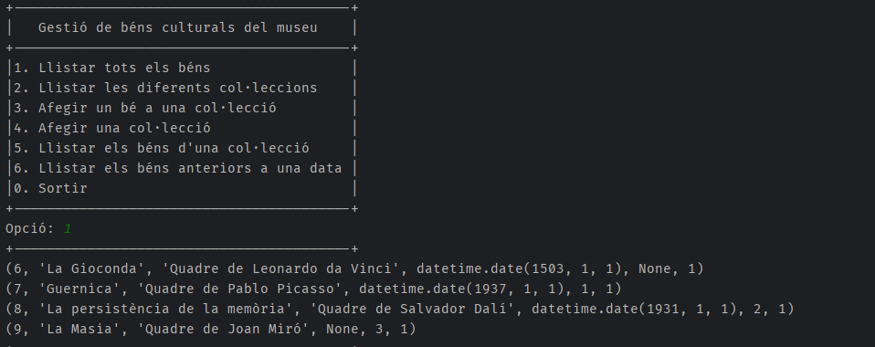

# Programa de gestió de béns per a un museu

## Descripció
Aquest és un programa de gestió de béns culturals per a un museu. Permet llistar tots els béns culturals del museu, les diferents col·leccions, afegir nous béns a una col·lecció, llistar els béns d'una col·lecció i llistar els béns anteriors a una data.

El programa està implementat en Python i fa servir una base de dades PostgreSQL.

## Components
### Python
El programa Python es compon del següent:

`connect_db()`: Funció que connecta al servidor PostgreSQL i retorna l'objecte connexió.

`llistat_bens()`: Funció que retorna tots els béns culturals de la base de dades.

`llistat_colleccions()`: Funció que retorna les diferents col·leccions de béns culturals de la base de dades.

`afegir_ben()`: Funció que permet afegir un nou bé cultural a la base de dades.

`llistat_bens_colleccio()`: Funció que retorna els béns culturals d'una col·lecció determinada.

`llistat_bens_anteriors()`: Funció que retorna els béns culturals anteriors a una data determinada.

`Menú`: Interfície que permet a l'usuari interactuar amb el programa i triar les diferents opcions.

### Base de dades
La base de dades PostgreSQL es compon del següent:

- **col_leccions**: Taula que conté les diferents col·leccions de béns culturals. Conté els següents camps:
    - **id**: Identificador únic de la col·lecció.
    - **nom**: Nom de la col·lecció.
    - **descripcio**: Descripció de la col·lecció.

- **autors**: Taula que conté els autors dels béns culturals. Conté els següents camps:
  - **id**: Identificador únic de l'autor.
  - **nom**: Nom de l'autor.
  - **cognoms**: Cognoms de l'autor.

- **bens_culturals**: Taula que conté tots els béns culturals del museu. Conté els següents camps:
    - **id**: Identificador únic del bé cultural. 
    - **nom**: Nom del bé cultural. 
    - **descripcio**: Descripció del bé cultural. 
    - **data_creacio**: Data de creació del bé cultural. 
    - **id_autor**: Identificador de l'autor del bé cultural. 
    - **id_col_leccio**: Identificador de la col·lecció a la qual pertany el bé cultural.

## Instal·lació

### Requisits

1. Per poder executar el programa és necessari tenir instal·lat Python i PostgreSQL.
2. Tenir el modul `psycopg2` instal·lat per Python. Per instal·lar-lo, executar el següent: `pip install psycopg2`.
### Pasos

1. Descarregar el repositori.
2. Executar el fitxer `museu.sql` per crear la base de dades i les taules.
3. Executar el fitxer `museu.py` per executar el programa.
4. Seguir les instruccions que apareixen a la pantalla.
5. Opcional: Executar el fitxer `demo.sql` per afegir dados d'exemple a la base de dades.

## Autor
**_Eduardo Morell Muniz_**
